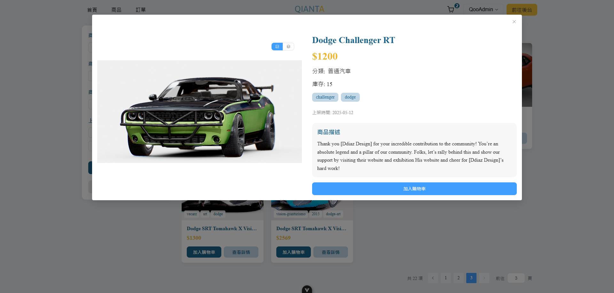
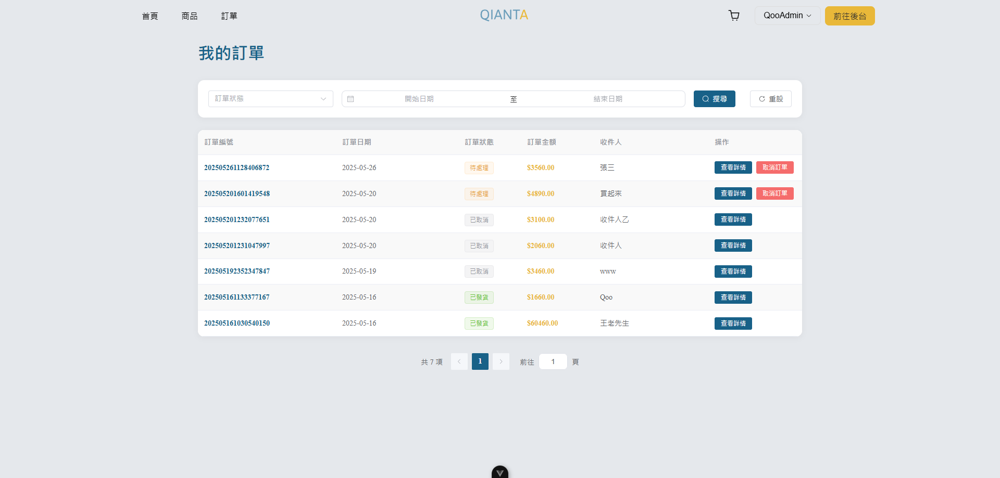

<div align="center">
  
# 🚗 QianTa 汽車商城全端專案


  


*完整的電商管理系統 | 前後台分離架構 | 4個月學習成果*

</div>

---

## 🎥 完整功能演示

<div align="center">

**📺 將你的 `full-demo.mp4` 上傳後，GitHub會自動生成影片ID，替換下方連結**

https://github.com/Qoo143/QianTa/assets/你的GitHub用戶ID/影片資源ID

*3分鐘完整展示 - 從前台購物體驗到後台管理系統*

</div>

---

## 🎯 專案亮點

- 🛒 **完整電商閉環** - 商品瀏覽 → 購物車 → 結帳 → 訂單管理
- 🎭 **3D商品展示** - model-viewer 實現立體商品預覽
- 🔄 **狀態管理** - Pinia 實現購物車跨頁面數據同步  
- 🎨 **動畫效果** - GSAP ScrollTrigger 打造流暢滾動體驗
- 🔐 **權限分離** - JWT 身份驗證，前後台角色區分
- 📦 **模組化設計** - 前後端分離，RESTful API 標準

---

## 🛠 技術架構

### 前端技術棧
```
Vue 3 + TypeScript + Pinia
├── UI框架: Element Plus
├── 動畫庫: GSAP + ScrollTrigger  
├── 3D展示: Google Model Viewer
├── 狀態管理: Pinia Store
├── 路由管理: Vue Router
└── 樣式處理: SCSS
```

### 後端技術棧
```
Express.js + MySQL
├── 身份驗證: JWT + bcryptjs
├── 檔案上傳: Multer
├── 資料驗證: Joi
├── 資料庫: MySQL + 連接池
├── API設計: RESTful
└── 錯誤處理: 統一中間件
```

---

## ✨ 核心功能展示

### 🛒 前台購物體驗
<table>
  
  <tr>
     <td width="100%">
      
      <p align="center"><b>官網首頁</b></p>
    </td>
    <td>
      
      <p align="center"><b>商品頁面</b></p>
    </td>
    <td>
      
      <p align="center"><b>購物車</b></p>
    </td>
     <td>
      
      <p align="center"><b>數量選擇</b></p>
    </td>
    <td>
      
      <p align="center"><b>商品詳情</b></p>
    </td>
     <td>
      
      <p align="center"><b>3d預覽</b></p>
    </td>
     <td>
      
      <p align="center"><b>結帳頁面</b></p>
    </td>
    <td>
      
      <p align="center"><b>訂單列表</b></p>
    </td>
     <td>
      
      <p align="center"><b>訂單詳情</b></p>
    </td>
  </tr>
</table>

### 🔧 後台管理系統
<table>
  <tr>
    <td width="50%">
      
      <p align="center"><b>產品列表</b></p>
    </td>
    <td width="50%">
      
      <p align="center"><b>添加產品</b></p>
    </td>
  </tr>
  
  <tr>
    <td width="50%">
      
      <p align="center"><b>添加產品</b></p>
    </td>
    <td width="50%">
      
      <p align="center"><b>標籤管理</b></p>
    </td>
  </tr>
  
  <tr>
    <td width="50%">
      
      <p align="center"><b>分類管理</b></p>
    </td>
    <td width="50%">
      
      <p align="center"><b>添加分類</b></p>
    </td>
  </tr>
  
</table>
### 🔧 登入與註冊
<table>
  <tr>
    <td width="50%">
      
      <p align="center"><b>登入頁面</b></p>
    </td>
    <td width="50%">
      
      <p align="center"><b>註冊頁面</b></p>
    </td>
  </tr>
</table>

---

## 🏗 系統架構設計


### 架構特點
- **前後端分離**：Vue SPA + Express API Server
- **數據庫設計**：關聯式設計，支援商品、用戶、訂單完整關聯
- **身份驗證**：JWT Token 機制，支援權限控制
- **檔案管理**：支援商品圖片、3D模型檔案上傳存儲

---

## 🔧 技術挑戰與解決方案

### 購物車狀態同步
**挑戰**：用戶在不同頁面間購物車數據需保持一致  
**解決**：Pinia Store + localStorage 持久化存儲

### 多檔案上傳處理  
**挑戰**：商品需同時上傳多張圖片和3D模型檔案  
**解決**：Multer中間件 + 事務處理確保數據完整性

### JWT權限控制
**挑戰**：前台用戶與後台管理員權限區分  
**解決**：JWT Token攜帶角色信息 + 路由中間件驗證

### 3D模型展示
**挑戰**：商品3D模型在瀏覽器中展示  
**解決**：Google Model Viewer + GLB格式支援

---

## 📊 專案數據

- **開發週期**：2個月完整開發
- **代碼量**：前端 15,000+ 行，後端 8,000+ 行  
- **功能模組**：用戶認證、商品管理、購物車、訂單處理
- **API接口**：20+ 個 RESTful 接口
- **數據表**：12 個核心業務表

---

## 🚀 快速開始

### 前端啟動
```bash
cd finall_front
npm install
npm run dev
```

### 後端啟動  
```bash
cd finall_back
npm install
# 配置 .env 環境變數
npm start
```

### 環境需求
- Node.js 18+
- MySQL 8.0+
- Vue CLI 5+

---

## 📋 主要功能

### 前台功能
- ✅ 用戶註冊登入
- ✅ 商品瀏覽搜索  
- ✅ 3D商品展示
- ✅ 購物車管理
- ✅ 結帳流程
- ✅ 訂單查詢

### 後台功能
- ✅ 商品管理 (CRUD)
- ✅ 圖片上傳管理
- ✅ 3D模型上傳
- ✅ 分類標籤管理  
- ✅ 訂單狀態管理
- ✅ 用戶權限控制

---

## 🔗 相關連結

- **🌐 [前端專案](https://github.com/Qoo143/finall_front)** - Vue 3 + TypeScript 用戶界面
- **⚙️ [後端專案](https://github.com/Qoo143/finall_back)** - Express + MySQL API 服務  
- **🏠 [開發者簡介](https://github.com/Qoo143)** - 更多專案與技術經歷

---

## 📝 開發心得

這個專案是我從零基礎學習程式開發4個月後的成果展現。從最初的 HTML/CSS 基礎，到掌握 Vue 3 生態系，再到後端 Express 開發，每一步都充滿挑戰。

最大的收穫是理解了全端開發的完整流程，以及如何運用 AI 輔助開發來提升效率。雖然代碼還有優化空間，但功能的完整性讓我對自己的學習成果很有信心。

---

<div align="center">

**⭐ 如果這個專案對你有幫助，請給個 Star 支持！**

**📧 聯絡方式**: wayne676803@gmail.com

</div>
